## **Introduction**

High-throughput transcriptome sequencing also known as RNA sequencing (RNA-Seq), has become a potent and widely used method to qualitatively and quantitatively study an organism. The power of sequencing RNA lies in the fact that the twin aspects of discovery and quantification can be combined in a single high-throughput sequencing assay. RNA-Seq data analysis enable researchers to quantify gene expression, identify splice junctions and find novel transcripts using the publicly available software.  To draw biological conclusions based on RNA-Seq data, several steps, some of which are computationally intensive, have to be taken. An important aspect of dealing with this vast amount of data generated is the processing method used to extract and intercept the information. There is no optimal pipeline for the variety of different applications and analysis scenarios in which RNA-seq data can be investigated. Scientists plan experiments and adopt different analysis strategies depending on the organism being studied and their research goals. Both the experimental design and the analysis procedures vary greatly in each of these cases.

Bioconductor offers a large number of packages for the statistical analysis of RNA-Seq data, however, most of them focus on one or two specific aspects of data analysis. Combining them appropriately requires a good understanding of their functionalities and depending on the data, different combinations of these packages have to be used leading to a tough learning curve for RNA-Seq novice. Here we introduce an integrated R based RNA-Seq analysis package, (package name), providing utilities for running an automated end-to-end analysis workflow to ease the processing of RNA-seq data analysis.    

While RNA-Seq data have a wide range of applications, such as alternative splicing research, fusion gene finding, novel transcript discovery, etc., the most important and widely focused application in most bioconductor packages for RNA-seq analysis is the quantification of gene expression profiles and the assessment of differentially expressed genes (DEGs). Although individual packages are present for these analyses but an integrated pipeline which covers all important aspects of RNA-seq analysis is rarely seen. The tools that focus on specific aspects of the data analysis pipeline are most difficult to appropriately integrate with one another due to their disparate data structures and processing methods. Here we introduce RNAseqAnalysis, an R/Bioconductor based package that simplifies the processing of RNA sequencing data, hiding the complex interplay of the required packages behind simple functionality that can be readily implemented.

In this workflow, we analyze RNA-sequencing data from the Caenorhabditis elegans, demonstrating and explaining the use of this pipeline, that utilizes popular biocounductor packages to import, organize, filter and normalize the data, followed by the differential expression, go term annotation and splice junction analysis. This pipeline further offers an interactive exploration of the results so that individual samples and genes can be examined by the user in form of plots and spreadsheets. 

### Experimental data

The mini sample FASTQ files used in this overview vignette and the associated workflow is provided along with the database. The chosen data set SRP099636  contains 14 paired-end (PE) read sets from Caenorhabditis elegans (Ma et al. 2016). To minimize processing time during testing, each FASTQ file has been subsetted to 90,000 randomly sampled PE reads. The corresponding reference genome sequence (FASTA) and its GFF annotation files have not been truncated, as they can be downloaded using Bioconductor during the run as required. The entire test sample data set requires less than 400MB disk storage space. A PE read set has been chosen for this test data set for flexibility, because it can be used for testing both types of analysis routines requiring either SE (single end) reads or PE reads.

### Workflow

workflow/ (e.g. rnaseq/ or analysis/)

This is the directory of the R session running the workflow. It is always a good idea to set the current working directory (using setwd()) to this directory. Note, this directory can have any name (e.g. rnaseq, analysis or directory). Changing its name does not require any modifications in the run script(s). All the data and associated files required to run the pipeline must be present in this directory. Run the script ( *.Rnw or *.Rmd ) and sample annotation (targets.txt) files are located here.

Important subdirectories:

param/

Stores parameter files such as: *.param, *.tmpl and *_run.sh.

dataset/

FASTQ samples
Reference FASTA file
Annotations
etc.

results/

An empty results folder must be created in the current working directory before calling any function. If the results folder is not present before the functions are called then an error would arise. All the Alignment, variant and peak files (BAM, VCF, BED), Tabular result files, Images, and plots etc. generated would be saved in this folder

The following parameter files must be included in each workflow template:

targets.txt: initial one provided by the user; must contain the path to the sample data; an example format of the target file is given below.

*.param: defines parameter for input/output file operations, e.g. trim.param,  bwa.param, vartools.parm, …

## **Getting started**

### Installation

The package must be installed from GitHub. For this first, you need to install the devtools package. You can do this from CRAN using the command install.packages("devtools"). Then load the devtools package. Then you can install the package from git hub using install_github("author/package") 

```{r, eval = FALSE}
install.packages("devtools")
library(devtools)
install_github("Blessy/RNAseqAnalysis") 
```

### Loading package and documentation

```{r, eval = FALSE}
library("RNAseqAnalysis") # Loads the package
library(help="RNAseqAnalysis") # Lists package info
vignette("RNAseqAnalysis") # Opens vignette
```


```{r, results = "hide", warning = FALSE, message = FALSE}
#library("RNAseqAnalysis")
#setwd("~/RNAseqAnalysis")
#import_dataset()
```

### Structure of targets file

The FASTQ files are organized in the provided targets.txt file. This is the only file in this analysis workflow that needs to be generated manually, e.g. in a spreadsheet program. To import targets.txt, we run the following commands from R. The targets file defines all input files (e.g. FASTQ, BAM, BCF) and sample comparisons of an analysis workflow. The following shows the format of a sample targets file provided by this package. In a target file with a single type of input files, here FASTQ files of the single end (SE) reads, the first three columns are mandatory including their column names, while it is four mandatory columns for FASTQ files for PE reads. All subsequent columns are optional and any number of additional columns can be added as needed.

#### Structure of targets file for single end (SE) samples

```{r}
library(RNAseqAnalysis)
targetspath <- "targets.txt"
read.delim(targetspath, comment.char = "#")
```

To work with the custom data, users need to generate a targets file containing the paths to their own FASTQ files and then provide under targetspath the path to the corresponding targets file.

#### Structure of targets file for paired end (PE) samples

```{r}
library(RNAseqAnalysis)
targetspath <- "targetsPE.txt"
read.delim(targetspath, comment.char = "#")
```

#### Sample comparisons

Sample comparisons are defined in the header lines of the targets file starting with ‘# <CMP>’.

```{r}
library(RNAseqAnalysis)
targetspath <- "targetsPE.txt"
readLines(targetspath)
```

The function readComp imports the comparison information and stores it in a list. Alternatively,  readComp can obtain the comparison information from the corresponding SYSargs object (see below). Note, these header lines are optional. They are mainly useful for controlling comparative analyses according to certain biological expectations, such as identifying differentially expressed genes in RNA-Seq experiments based on simple pair-wise comparisons.

```{r}
library(RNAseqAnalysis)
library(systemPipeR)
targetspath <- "targetsPE.txt"
readComp(file=targetspath, format="vector", delim="-")
```

#### Structure of param file and SYSargs container

The param file defines the parameters of the command-line software. The following shows the format of a sample param file provided by this package.

```{r}
library(RNAseqAnalysis)
parampath <- "tophat.param"
read.delim(parampath, comment.char = "#")
```

The systemArgs function from systemPipeR package imports the definitions of both the param file and the targets file, and stores all relevant information as a SYSargs object. To run the pipeline without command-line software, one can assign NULL to sysma instead of a param file. In addition, one can start the workflow with pre-generated BAM files by providing a targets file where the FileName column gives the paths to the BAM files and sysma is assigned NULL.


##  **Functions overview**

### Quality Control

Quality control (QC) is a critical step in RNA sequence analysis. Yet, it is often ignored or conducted on a limited basis. In this package, we offer a multi-perspective approach for QC of raw read data. At the raw data level, the most common parameters examined are the total number of reads sequenced, GC content, k-mers by position and the overall base quality score, which are all commonly computed by standard raw data QC tools. RNAseq Quality Control is performed by using two functions frqc and fqcR, which is an integrated, simplified quality control system that allows easy execution of several R packages. It comprises of two main sections. First is the function frqc, which basically provides a wrapper around the bioconductor package Rqc making it a single function. Rqc is an optimized tool designed for quality control and assessment of high-throughput sequencing data. It performs parallel processing of an entire raw read file in the dataset and produces a report which contains a set of high-resolution graphics that can be used for quality assessment. Second is the function fqcR which is an integration of several functions of the bioconductor package qrqc into a single function. The qrqc (Quick Read Quality Control) package is a fast and extensible package that reports basic quality and summary statistics on FASTQ files one raw read file at a time.

#### Basic workflow

```{r, results = "hide", warning = FALSE, message = FALSE}
library(RNAseqAnalysis)
setwd("~/RNAseqAnalysis")
files <- list.files(path = "./dataset/", pattern = ".fastq.gz", all.files = FALSE, full.names = TRUE)
fqcR(groups=rep("None", 28), pairs=c(1,1,2,2,3,3,4,4,5,5,6,6,7,7,8,8,9,9,10,10,11,11,12,12,13,13,14,14))
```

To access fqcR functionality, the first step is to load RNAseqAnalysis package.

The next step is to determine the location of the FASTQ files that should be analyzed, before running the function make sure all the raw data files are placed in the data folder of your workspace. 

The basic usage of the fqcR function will run on all the default parameters. By default, all input files are treated as single-end. For paired-end, the user needs to define a vector of numbers where two indexes with the same value represent a pair. It is important to note that the rqc function samples 1 million records from the FASTQ files. This can be set by adjusting the n argument for this function. If the user desires to have the file processed as a whole, then the user must set the argument samples to FALSE and define no argument

```{r, results = "hide", warning = FALSE, message = FALSE}
library(RNAseqAnalysis)
setwd("~/RNAseqAnalysis")
frqc()
```

To access frqc functionality, the first step is to load RNAseqAnalysis package.

The basic usage of the fqcR function will run on all the default parameters. On calling the function frqc a pop-up window will appear through which the user can select the raw read file. After its execution is complete results will be saved in folder results/QC-report and the user will then have to enter 1 in order to continue using the function to check the quality of other read files or may enter 0  to stop the function. In case the user wants to run the second file too (i.e., the user has pressed 1) its a better idea to select all the image file generated from the previous run and save it to a new folder (named after the read files for better differentiation), or the images will be overwritten by the new images generated.

#### Result generated
File Information as below will be obtained in the console

|       filename      |  pair | format | group |  reads  |total.reads|  path |
|:--------------------|:-----:|:------:|:-----:|:-------:|:---------:|:-----:|
|SRR5253683_1.fastq.gz|  1    | FASTQ  | None  | 1000000 | 2543925   | data  |
|SRR5253683_2.fastq.gz|  1    | FASTQ  | None  | 1000000 | 2543925   | data  |
|SRR5253684_1.fastq.gz|  2    | FASTQ  | None  | 1000000 | 4181836   | data  |
|SRR5253684_2.fastq.gz|  2    | FASTQ  | None  | 1000000 | 4181836   | data  |
|SRR5253685_1.fastq.gz|  3    | FASTQ  | None  | 1000000 | 3105000   | data  |
|SRR5253685_2.fastq.gz|  3    | FASTQ  | None  | 1000000 | 3105000   | data  |
|SRR5253686_1.fastq.gz|  4    | FASTQ  | None  | 1000000 | 9735382   | data  |
|SRR5253686_2.fastq.gz|  4    | FASTQ  | None  | 1000000 | 9735382   | data  |


A total of 8 plots will be saved in jpeg format as well as a html report will also be saved in the folder results/QC-report. The following images are generated:

**1. This plot describe an overview of per read mean quality distribution of all files**

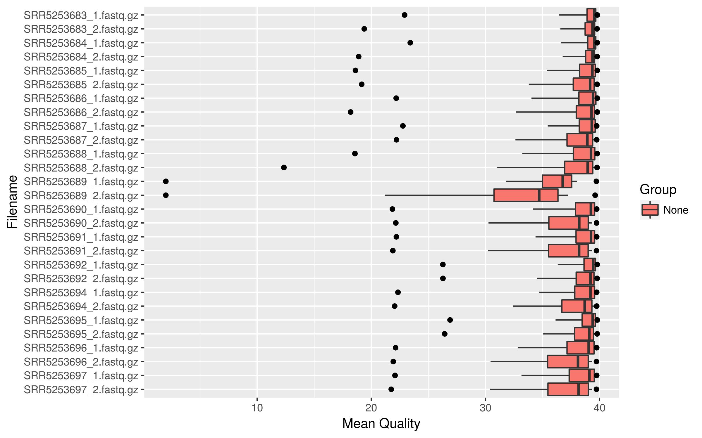
  
**2. This plot describes the average quality pattern by showing on the X-axis quality thresholds and on the Y-axis the percentage of reads that exceed that quality level.**

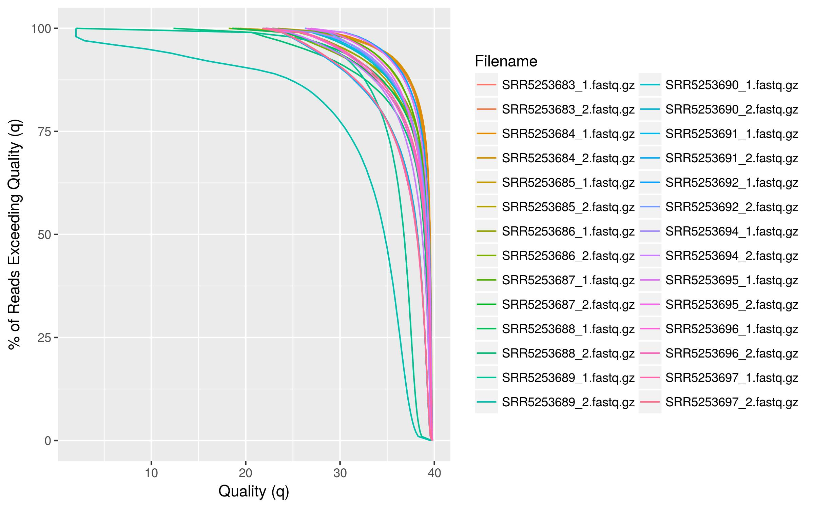
 
**3. This describes the average quality scores for each cycle of sequencing.**

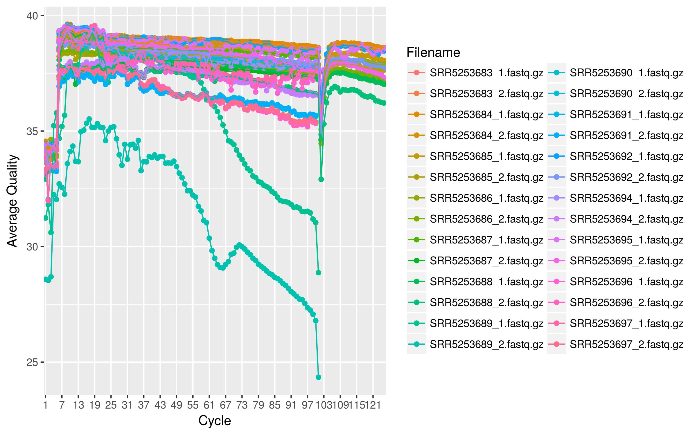

**4. This plot shows the proportion of reads that appeared many times.**

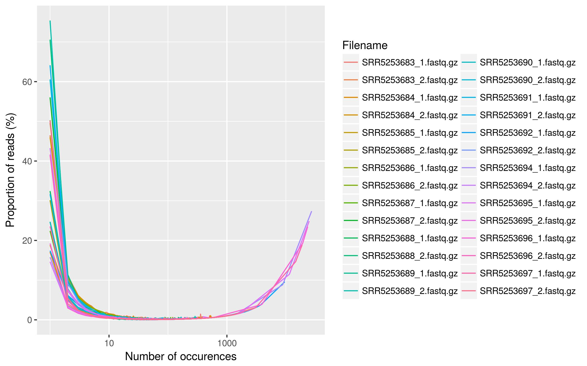

**5. This heatmap plot shows dstance matrix between top represented reads. This functon only works with one result file (and not a list).**

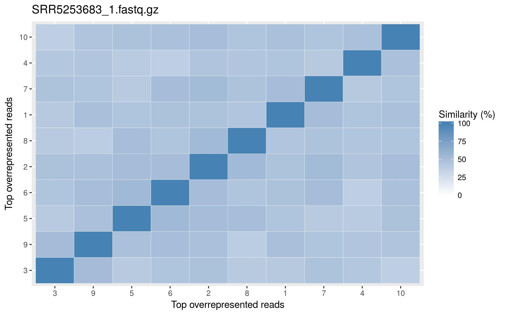

**6. Barplot that presents the distribuition of the lengths of the reads available in the FASTQ file.**

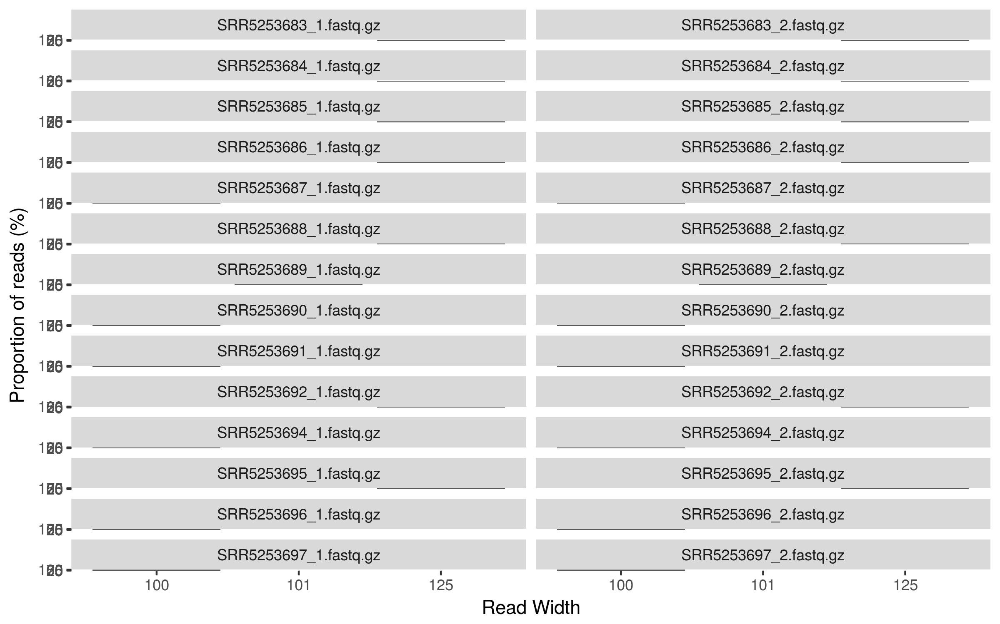

**7. Line plot showing the average GC content for every cycle of sequencing.**

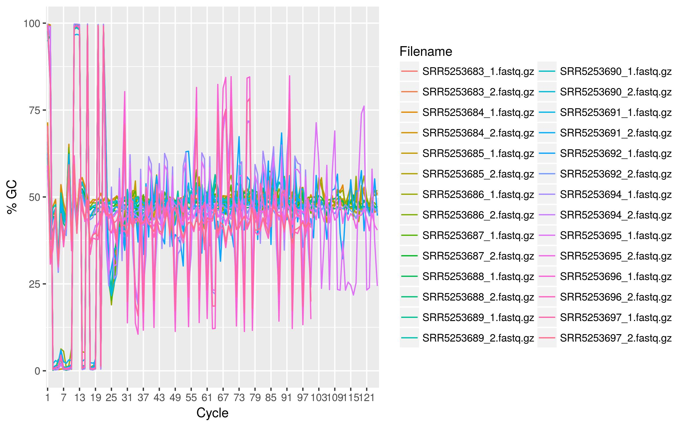
  
**8. Biplot from Principal Component Analysis (PCA) of cycle-specific read average quality.**

{:.center}

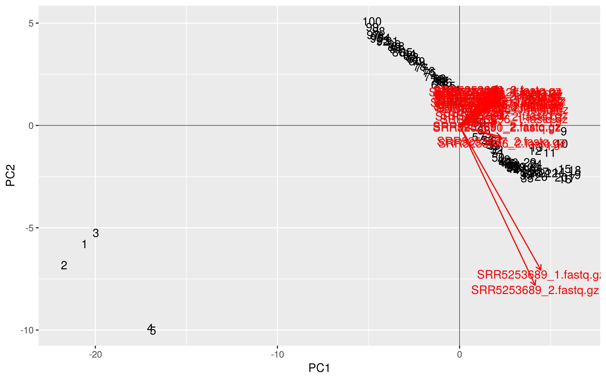

Other than these plots Bar plot showing the proportion of quality calls per cycle, a boxplot describing empirical patterns of quality distribution on each cycle of sequencing, a bar plot and line plot describes the proportion of each nucleotide called for every cycle of sequencing will also be present in the html report.

On running the function frqc the file information as below will be obtained in the console
Quality Information for: ./dataset/SRR5253683_1.fastq.gz
 
9735382 sequences, 2286422 unique with 0.10 being sampled
 
 mean quality: 37.715700
 
 min sequence length: 125
 
 max sequence length: 125

A total of 5 plots will be saved in jpeg format as well as an html report will also be saved in the folder results/QC-report. The following images are generated:

**1. This plot describe an overview of quality by base position distribution of the dataset**

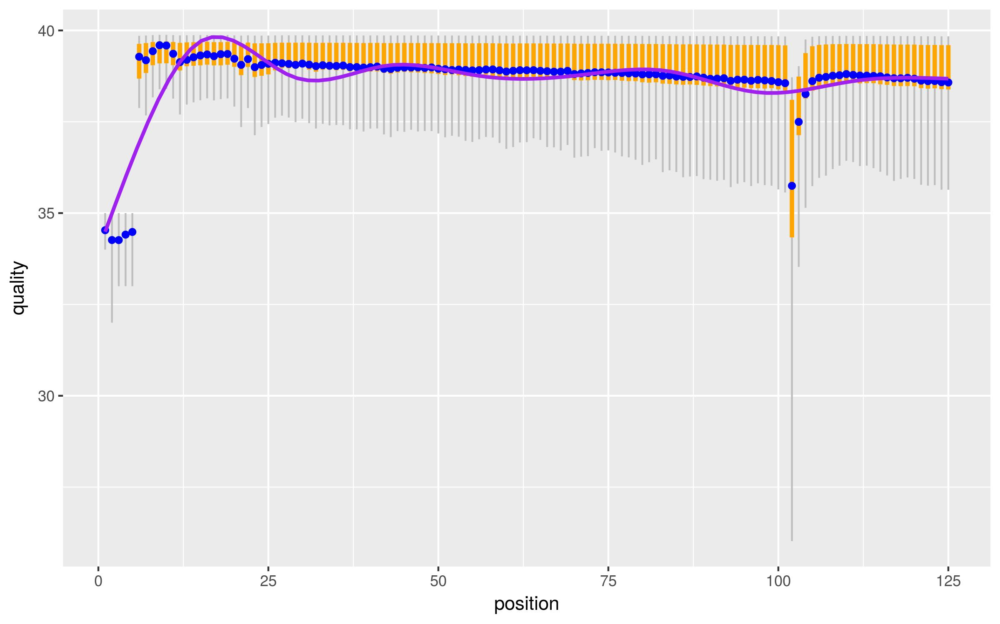


**2. These plots describe an overview of Base frequencies (counts) and base proportions by position for the  file**    

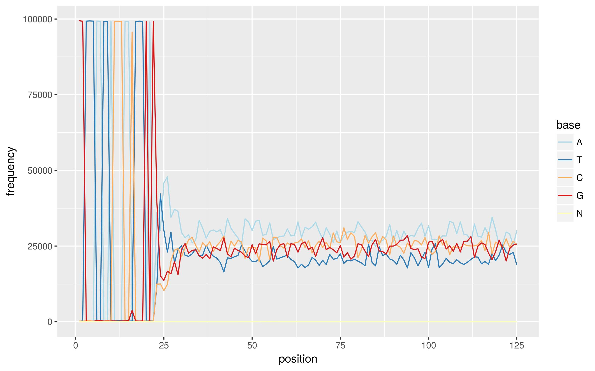

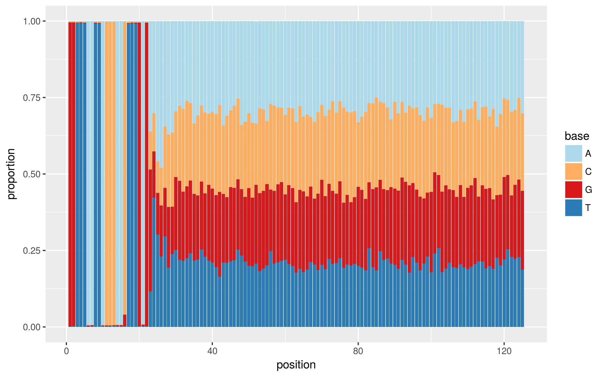

 **3. This plot describe an overview of the GC content present within the reads**

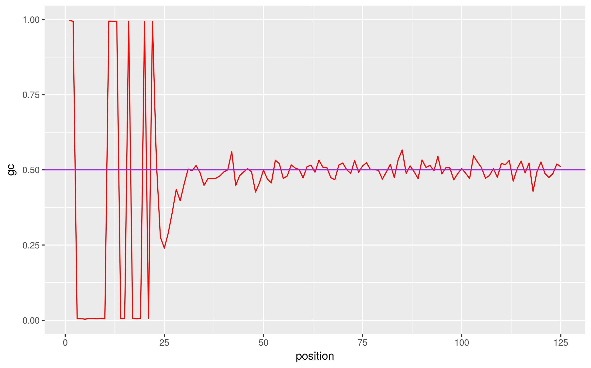  
    
    
**4. The distribution of k-mers is calculated across all positions and the  result is a data frame of the K-L terms, of which a subset are stacked in the plot produced**

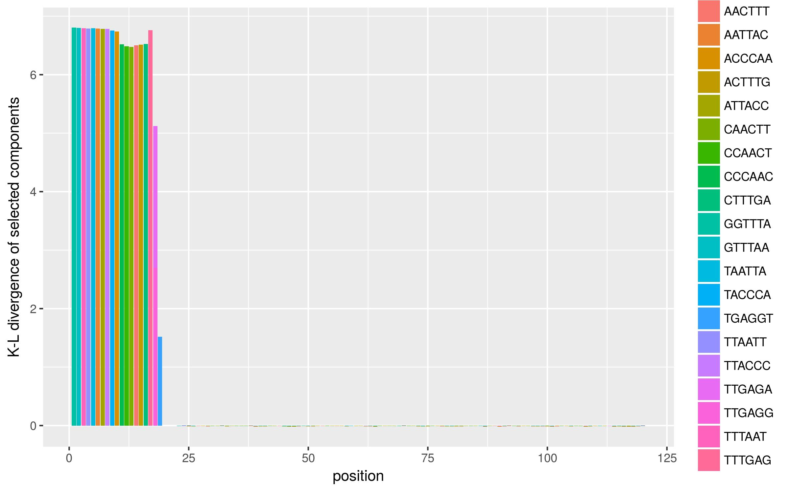
    
### Filtering

One pre-processing step that is disparately applied in RNA seq preprocessing is trimming and filtering, in which low-quality bases, identified by the probability that they are called incorrectly, are removed. Use of quality filters can improve the reliability of data. For stringent filters, where the loss of reads is bigger, the number of unique differentially expressed genes was greater. Quality filters can affect all expression profiles of genes even for high-quality data. The preprocessing in RNAseq pipeline is performed using a filtering and trimming functions from the package ShortRead. The basic structure is to open a FASTQ file, iterate through chunks of the file performing filtering or trimming steps, and appending the filtered data to a new file. Basically each user selected raw data file (in .fastq.gz format) are filtered and trimmed, based on three parameters, raw reads containing N are removed, regions having a phred score less than the value defined by user or less than a phred score of 20 (by default) is trimmed out, as well as sequence reads that have number of bases less than the value given by user or less than 36nt (default value) is removed.

#### Basic workflow

```{r, results = "hide", warning = FALSE, message = FALSE}
library(RNAseqAnalysis)
setwd("~/RNAseqAnalysis")
filteR()
```

To access filteR functionality, the first step is to load RNAseqAnalysis package. Next step is to call the function, doing which would prompt open a selection window, using which the user needs to select the raw data file to be trimmed. On the console, the user would then be required to "Enter the name for output file" (filtered data file), which would be saved in a new directory named "filtered_data" within the workspace directory. Its always essential to save your filtered file with the extension .fastq.gz, so that its convenient for downstream analysis. Next, the user would be asked whether they want to continue "Enter 0 TO STOP EXECUTION/ 1 TO CONTINUE:". Up to 20 raw data files could be filtered within a single call of this function by pressing '1' (one) each time the user wants to continue. Pressing '0' will terminate the function.

#### Result generated
The basic file information of the selected raw data file is printed on the console:- 

class: ShortReadQ

length: 4181836 reads; width: 125 cycles

The filtered file is saved in a file (named by the user) to the filtered_data directory that is automatically created when the function is called. This directory can be renamed as dataset if you wish to use the filtered data for downstream analysis instead of raw data.

### Count Matrix generation

As input, the count-based statistical methods, such as DESeq2 (Love, Huber, and Anders 2014), edgeR (M. D. Robinson, McCarthy, and Smyth 2009), limma with the voom method (Law et al. 2014), DSS (H. Wu, Wang, and Wu 2013), EBSeq (Leng et al. 2013) and baySeq (Hardcastle and Kelly 2010), expect input data as obtained, from RNA-seq or another high-throughput sequencing experiment, in the form of a matrix of integer values. The value in the i-th row and the j-th column of the matrix tells how many reads/fragments, have been assigned to gene i in sample j. The values in the matrix should be counts of sequencing reads/fragments. This is important for DESeq2’s statistical model to hold, as only counts allow assessing the measurement precision correctly. It is important to never provide counts that were pre-normalized for sequencing depth/library size, as the statistical model is most powerful when applied to un-normalized counts, and is designed to account for library size differences internally. In RNAseqAnalysis package, the reads overlapping with annotation ranges of interest are counted for each sample using the summarizeOverlaps function (Lawrence et al., 2013) from  GenomicRanges package. The read counting is performed for exonic gene regions in a non-strand-specific manner while ignoring overlaps among different genes. Subsequently, the expression count values are normalized by reads per kb per million mapped reads (RPKM). The raw read count table (countDFeByg.xls) and the corresponding RPKM table (rpkmDFeByg.xls) are written to separate files in the results directory. Note, for most statistical differential expression or abundance analysis methods, such as edgeR or DESeq2, the raw count values should be used as input. The usage of RPKM values should be restricted to specialty applications required by some users, e.g. manually comparing the expression levels among different genes or features.

#### Basic workflow

```{r, results = "hide", warning = FALSE, message = FALSE}
library("biomartr", lib.loc="~/R/x86_64-pc-linux-gnu-library/3.4")
library(RNAseqAnalysis)
setwd("~/RNAseqAnalysis")
library(BSgenome.Celegans.UCSC.ce11)
export(Celegans, "dataset/ce11.fasta", compress=FALSE)
getGFF(db = "ensemblgenomes", organism = "Caenorhabditis elegans", reference = TRUE, path = file.path("dataset"))
system("gunzip dataset/Caenorhabditis_elegans.WBcel235.39_ensemblgenomes.gff3.gz")
library("rtracklayer", lib.loc="~/R/x86_64-pc-linux-gnu-library/3.4")
gffRangedData <- import.gff("dataset/Caenorhabditis_elegans.WBcel235.39_ensemblgenomes.gff3")
myGranges<-as(gffRangedData, "GRanges")
seqlevelsStyle(myGranges)
seqlevelsStyle(myGranges) <- "UCSC"
myGranges
export(object = myGranges, con = "dataset/Caenorhabditis_elegans.gff3", format = "gff3", index = FALSE)
system("gunzip dataset/Caenorhabditis_elegans.gff3.bgz")
condition <- factor(c("N1","N1","N2","N2","M1","M1","M2","M2","M3","M3","M4","M4","U1","U1"))
countT(sysma = "./param/tophat.param", mytargets = "./param/targetsPE.txt", file="dataset/Caenorhabditis_elegans.gff3", filter = c(Fold=2, FDR=100), con = condition)
```

To access countT functionality, the first step is to load RNAseqAnalysis package. Next step is to call the function as shown above. The computational analysis of an RNA-seq experiment begins from the FASTQ files that contain the nucleotide sequence of each read and a quality score at each position. These reads must first be aligned to a reference genome or transcriptome. A number of arguments must be defined besides the features and the reads when calling the function. 

When the function is called the user would be asked to "enter 'bowtie2-build' path/to/fasta_file path/to/fasta_file". The user must enter their complete path to the reference fasta file (for example to run the data in tutorial user must enter "bowtie2-build ./dataset/Caenorhabditis_elegans.WBcel235.dna.chromosome.I.fa ./dataset/Caenorhabditis_elegans.WBcel235.dna.chromosome.I.fa", without quotes). 

Align all FASTQ files with Bowtie2/Tophat2 on a single computer. Includes generation of indexed BAM files. For this, the user must have installed Bowtie2/Tophat2 in their system and must have defined the target and param files as stated above.

Next step is to read in the gene model that will be used for counting reads/fragments. The gene model is read from an Ensembl GTF file (Flicek et al. 2014), using makeTxDbFromGFF from the GenomicFeatures package. GTF files can be downloaded from Ensembl’s FTP site or other gene model repositories. A TxDb object is a database that can be used to generate a variety of range-based objects, such as exons, transcripts, and genes. Each element of the list is a GRanges object of the exons for a gene. After these preparations, the actual counting is done using the function summarizeOverlaps from the GenomicAlignments package. This produces a SummarizedExperiment object that contains a variety of information about the experiment. A GRangesList is produced by the TxDB generated for all the exons grouped by gene (Lawrence et al. 2013). Each element of the list is a GRanges object of the exons for a gene. The grouping can be done by either 'gene', 'exon', 'cds' or 'tx' which can be decided by the user during the run. 

During the run, the user would be asked to "provide one of 'gene', 'exon', 'cds' or 'tx' to determines the grouping." The user must enter any one of the following based on which the Txdb would be grouped. For running the example file the user can enter "gene".

It is important to know if the sequencing experiment was single-end or paired-end, as the alignment software will require the user to specify both FASTQ files for a paired-end experiment. The output of this alignment step is commonly stored in a file format called SAM/BAM. Note that fragments will be counted only once to each gene, even if they overlap multiple exons of a gene which may themselves be overlapping. Setting singleEnd to FALSE indicates that the experiment produced paired-end reads, and we want to count a pair of reads (a fragment) only once toward the count for a gene. The fragments argument can be used when singleEnd=FALSE to specify if unpaired reads should be counted (yes if fragments=TRUE). In order to produce correct counts, it is important to know if the RNA-seq experiment was strand-specific or not. This experiment was not strand-specific so we set ignore.strand to TRUE. However, certain strand-specific protocols could have the reads align only to the opposite strand of the genes. The user must check if the experiment was strand-specific and if so, whether the reads should align to the forward or reverse strand of the genes. For various counting/quantifying tools, one specifies counting on the forward or reverse strand in different ways, although this task is currently easiest with htseq-count, featureCounts, or the transcript abundance quantifiers mentioned previously. It is always a good idea to check the column sums of the count matrix (see below) to make sure these totals match the expected of the number of reads or fragments aligning to genes. These parameters are not provided while calling the function but are prompted inbetween the run. 

While the function is being run the user would be prompted to "enter FALSE for strand-specific RNA /TRUE for all other" and "enter TRUE for SINGLE END RNA /FALSE for PAIREND" where for strand-specific RNA-Seq set 'ignore.strand=FALSE' and for PE dataset 'singleEnd=FALSE'. To run the example dataset user must enter "TRUE" when asked for strand specificity and "FALSE" to determine that the data is pairend.

The function also helps in Sample-wise correlation analysis for clustering of samples using RPKM expression values and rlog values as well as generates Venn-diagram for Up and Down DEG Sets. The user is provided an option to select the sets for which the Venn diagram is to be produced. During the run the user would be asked to "enter the first number of sets", the number entered would represent the first set to be included in the Venn diagram. The user would again be prompted to "enter the last number of sets", the number entered, would mean that all the set up to that number would be included in the formation of Venn diagram. For obtaining the Venn diagram shown below using the example data set the user must first enter "1" and then enter "3"(without quotes). This means all the sets between the first and the last number indicated are used in the generation of Venn diagram. The number of the set is based as being named by the user in the targets.txt (targetsPE.txt for paired-end data) file. 

This process can be repeated with different sets of DGE by entering "1" when asked to continue.
**NOTE** The user must rename the file first generated, or it will be replaced by the last run.

#### Result generated
Some of the basic information regarding the output file locations and the run is provided on the console when the function is called. The corresponding BAM files generated are saved within separate folders named by there raw data filename in results folder. Four excel files are saved in the results folder namely alignStats.xls, countDFeByg.xls, edgeRcomp.xls, rpkmDFeByg.xls. The alignStats.xls contains the data frame containing important read alignment statistics such as the total number of reads in the FASTQ files, the number of total alignments, as well as the number of primary alignments in the corresponding BAM files. The countDFeByg.xls file contains the count matrix generated. The rpkmDFeByg.xls file contains the read count that is RPKM normalized. The edgeRcomp.xls contains identified differentially expressed genes (DEGs) in batch mode. 

**Analysis of differentially expressed genes (DEGs)**
The following figure shows DEG results for a given set of sample comparisons. The gene identifiers of all (i) Up_or_Down, (ii) Up and (iii) Down-regulated genes are stored as separate list components, while the corresponding summary statistics, stored in a fourth list component, is plotted in form of a stacked bar plot.

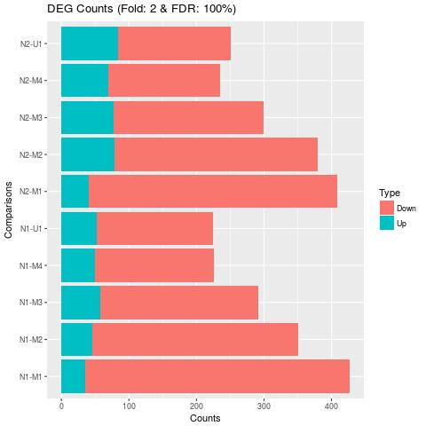

**Sample-wise correlation analysis**
Sample-wise correlation analysis can be done based on two ways:

1. Clustering of samples using RPKM expression values. QC check of the sample reproducibility could be done by computing a correlating matrix and plotting it as a tree. The following plot illustrates the dendrogram using the RPKM normalized expression values and the Spearman’s correlation coefficient.

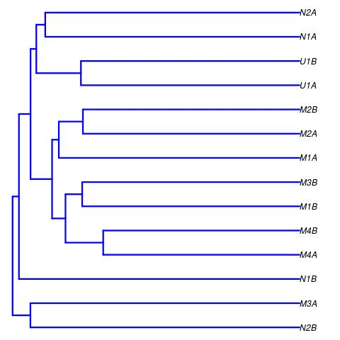

2. Clustering of samples with rlog values. The following computes the sample-wise Spearman correlation coefficients from the rlog (regularized-logarithm) transformed expression values generated with the DESeq2 package (Link). After the transformation to a distance matrix, hierarchical clustering is performed with the hclust function and the result is plotted as a dendrogram (sample_tree.pdf). In combination with Spearman correlation, the results of the two clustering methods are often relatively similar.

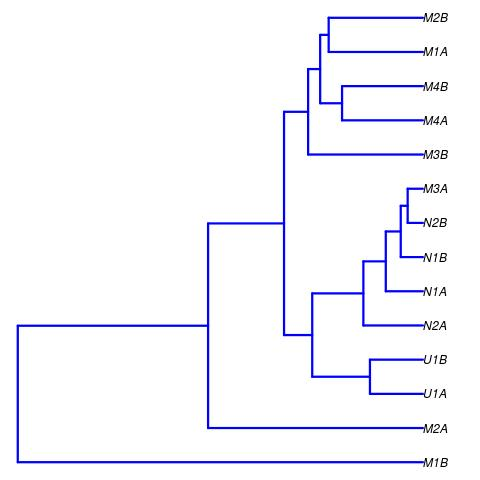

**Venn Diagrams**
The function overLapper and vennPlot of Systempiper package are used to generate the Venn diagrams. Different numbers of Venn diagrams may be generated using different sets of DEGs. The user must specify the DEG sets to be used for the creation of the Venn diagram. shown below are the Venn diagrams for DEG set 1 to 2 and for DEG set 3 to 6

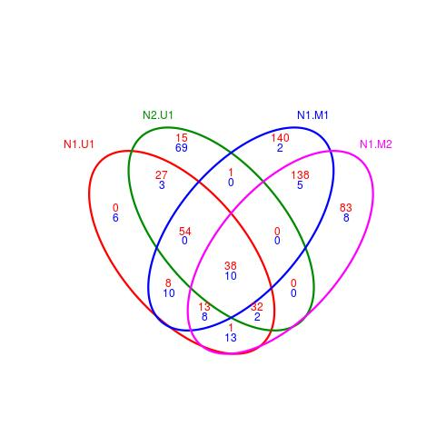

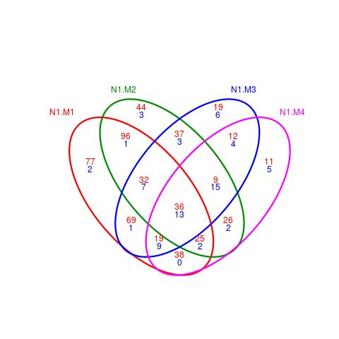

### Differential Gene Expression Analysis Plots

The next step is to test for differential expression between the experimental groups. The transcriptome is the whole set of RNAs transcribed from the genes of a cell, their relative abundances reflect the level of expression of the corresponding genes, for a specific developmental stage or physiological condition. The study of gene expression and differential gene expression can unveil important aspects about the cell states under investigation. Genes with very low counts across all libraries provide little evidence for differential expression. In the biological point of view, a gene must be expressed at some minimal level before it is likely to be translated into a protein or to be biologically important. In addition, the pronounced discreteness of these counts interferes with some of the statistical approximations that are used later in the pipeline. These genes should be filtered out prior to further analysis. Here, all the standard differential expression analysis steps like filtering, normalization, and heatmap generation etc., are wrapped into a single function gene_exp which provides the user with different graphical representations of differential gene expression within the sample.

#### Basic workflow

```{r, results = "hide", warning = FALSE, message = FALSE, fig.show = 'hide'}
library(RNAseqAnalysis)
setwd("~/RNAseqAnalysis")
pairs <- c( "paired-end", "paired-end", "paired-end","paired-end","paired-end","paired-end","paired-end", "paired-end", "paired-end","paired-end","paired-end","paired-end","paired-end","paired-end")
count <- c(1,1,2,2,3,3,4,4,5,5,6,6,7,7)
condition <- factor(c("N1","N1","N2","N2","M1","M1","M2","M2","M3","M3","M4","M4","U1","U1"))
gene_exp(sysma="./param/tophat.param", mytargets="targetsPE.txt", x = pairs, y = count, con = condition)
```

To access gene_exp functionality, the first step is to load RNAseqAnalysis package. Next step is to call the function as shown above. The most commonly used packages for differential gene expression analysis are edgeR and DESeq2. edgeR stores data in a simple list-based data object called a DGEList. This type of object is easy to use because it can be manipulated like any list in R. The main components of a DGEList object are a matrix counts containing the integer counts, a data.frame samples containing information about the samples or libraries, and an optional data.frame genes containing annotation for the genes or genomic features. Whereas, as input, the DESeq2 package expects count data as obtained, e.g., from RNA-seq or another high-throughput sequencing experiment, in the form of a matrix of integer values. The value in the i-th row and the j-th column of the matrix tells how many reads can be assigned to gene i in sample j. The values in the matrix should be un-normalized counts or estimated counts of sequencing reads (for single-end RNA-seq) or fragments (for paired-end RNA-seq). The RNA-seq workflow describes multiple techniques for preparing such count matrices. It is important to provide count matrices as input for DESeq2’s statistical model (Love, Huber, and Anders 2014) to hold, as only the count values allow assessing the measurement precision correctly. The DESeq2 model internally corrects for library size, so transformed or normalized values such as counts scaled by library size should not be used as input. Therefore, to run the function gene_exp it is important that users first run the function countT because the input required to run various differential gene expression analysis using packages like edgeR and DESeq2 is a count matrix, which is generated from the raw data using the function countT. Also, care must be taken to not manipulate the location of any files generated by the countT function.

In order to test for differential expression, we operate on raw counts and use discrete distributions as described in the previous section on differential expression. However, for other downstream analyses – e.g. for visualization or clustering – it might be useful to work with transformed versions of the count data.

#### Result generated
Results tables are generated and printed to the console, in form of a table with log2 fold changes, p values, and adjusted p values. Details about the comparison are present above the results table. The text, condition treated vs untreated, tells you that the estimates are of the logarithmic fold change log2(treated/untreated). These values will be saved as an excel file named as result.xls in the folder expression that is created automatically when the gene_exp function is called

log2 fold change (MLE): condition U1 vs M4 
Wald test p-value: condition U1 vs M4 
DataFrame with 3430 rows and 6 columns

|   name   | baseMean|log2FoldChange|    lfcSE|    stat   |pvalue   | padj    |
|:---------|:-------:|:------------:|:-------:|:---------:|:-------:|:-------:|
|21ur-11921|0.2292690|   -1.8455575 | 4.907720|-0.37605190|0.7068783|0.9683967|
|21ur-1232||0.3045178|     0.4123622| 4.997455| 0.08251444|0.9342376|0.9683967|
|21ur-13952|0.7253652|     3.8964201| 4.631472| 0.84129190|0.4001844|0.9683967|
|21ur-14385|0.6090356|     0.4123505| 4.997455| 0.08251210|0.9342395|0.9683967|
|21ur-14806|2.3393456|    -4.1914799| 3.114439|-1.34582162|0.1783601|0.9683967|
|..........|.........|..............|.........|...........|.........|.........|
|zyg-1     |0.4334931|      2.779132| 4.898132| 0.56738614|0.5704519|0.9683967|
|zyg-11    |0.7253652|      3.896420| 4.631472| 0.84129190|0.4001844|0.9683967|
|zyg-12    |0.3524508|      2.857021| 4.892238| 0.58399052|0.5592267|0.9683967|
|zyg-9     |0.3184131|      0.237419| 4.969934| 0.04777107|0.9618987|0.9683967|
|zyx-1     |2.3133117|     -2.200506| 3.478372|-0.63262543|0.5269783|0.9683967|

The summarized results containing some basic tallies using the summary function is also printed on the console and is also saved in an excel file named as result.xls
out of 3430 with nonzero total read count
adjusted p-value < 0.1
LFC > 0 (up)     : 1, 0.029% 
LFC < 0 (down)   : 0, 0% 
outliers [1]     : 0, 0% 
low counts [2]   : 0, 0% 
(mean count < 0)
[1] see 'cooksCutoff' argument of ?results
[2] see 'independentFiltering' argument of ?results

The same table is also generated for the shrunken log2 fold and saved as excel file named as shrunken_result.xls

**Removing and plotting genes that are lowly expressed**
All datasets will include a mix of genes that are expressed and those that are not expressed. Whilst it is of interest to examine genes that are expressed in one condition but not in another, some genes are unexpressed throughout all samples. Genes that are not expressed at a biologically meaningful level in any condition should be discarded to reduce the subset of genes to those that are of interest, and to reduce the number of tests carried out downstream when looking at differential expression. Upon examination of log-CPM values, it can be seen that a large proportion of genes within each sample is unexpressed or lowly-expressed (shown in panel A of the next figure). Using a nominal CPM value of 1 (which is equivalent to a log-CPM value of 0) genes are deemed to be expressed if their expression is above this threshold, and unexpressed otherwise. Genes must be expressed in at least one group (or in at least three samples across the entire experiment) to be kept for downstream analysis. Using this criterion, the number of genes is reduced to approximately half the number that we started. Note that subsetting the entire DGEList-object removes both the counts as well as the associated gene information. These values are further used to generate the plot as shown below

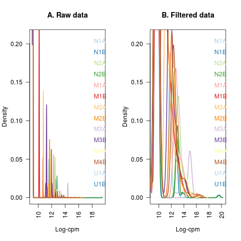

Dotted vertical lines mark the log-CPM of zero threshold (equivalent to a CPM value of 1) used in the filtering step

**The plot shows the log2 fold changes attributable to a given variable over the mean of normalized counts for all the samples generated using   plotMA  function of DESeq2.**
Points will be colored red if the adjusted p value is less than 0.1. Points which fall out of the window are plotted as open triangles pointing either up or down.

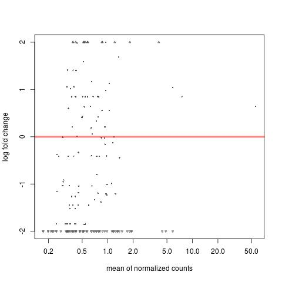

**It is more useful visualize the MA-plot for the shrunken log2 fold changes, which remove the noise associated with log2 fold changes from low count genes without requiring arbitrary filtering thresholds.**

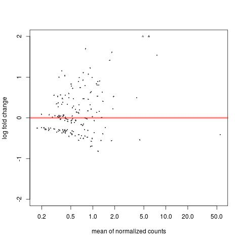

It can also be useful to examine the counts of reads for a single gene across the groups. A simple function for making this plot is plotCounts from DESeq2, which normalizes counts by sequencing depth and adds a pseudocount of 1/2 to allow for log scale plotting. The counts are grouped by the variables in  intgroup, where more than one variable can be specified. Here we specify the gene which had the smallest p value from the results table created above. 

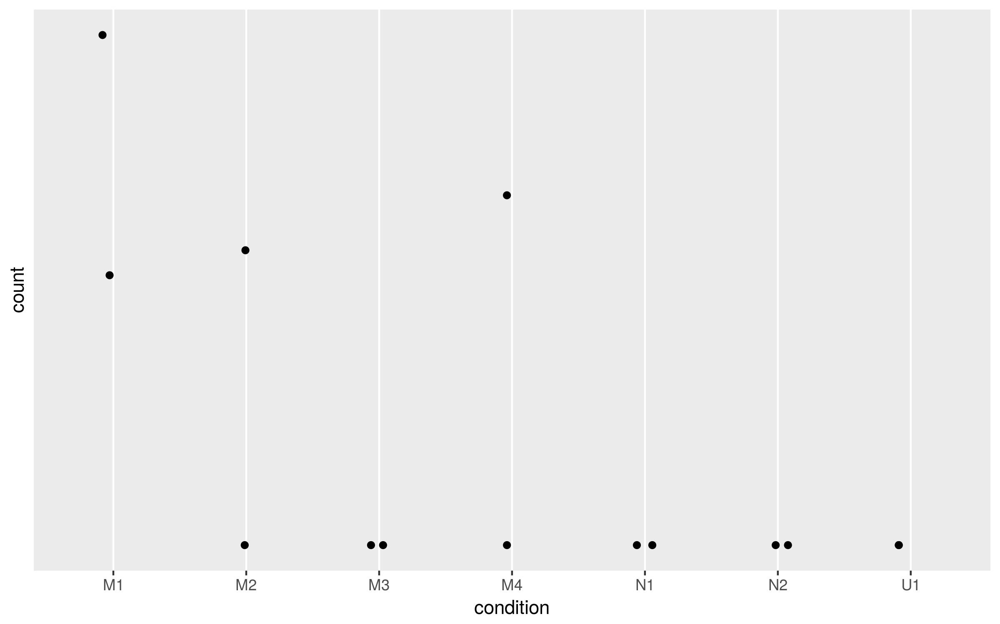
  
**Principal component plot of the samples**  
The PCA plot, which shows the samples in the 2D plane spanned by their first two principal components. This type of plot is useful for visualizing the overall effect of experimental covariates and batch effects.

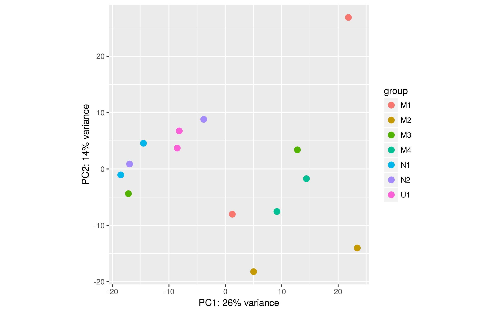 


**Effects of transformations on the variance**
The figure below plots the standard deviation of the transformed data, across samples, against the mean, using the shifted logarithm transformation, the regularized log transformation and the variance stabilizing transformation. The shifted logarithm has elevated standard deviation in the lower count range, and the regularized log to a lesser extent, while for the variance stabilized data the standard deviation is roughly constant along the whole dynamic range. Note that the vertical axis in such plots is the square root of the variance over all samples, so including the variance due to the experimental conditions. While a flat curve of the square root of variance over the mean may seem like the goal of such transformations, this may be unreasonable in the case of datasets with many true differences due to the experimental conditions.

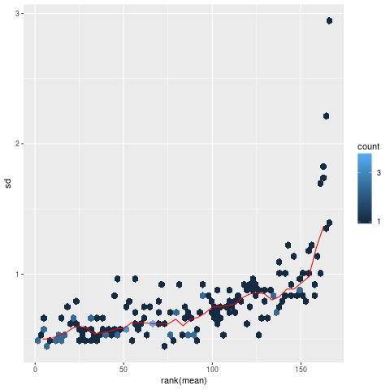

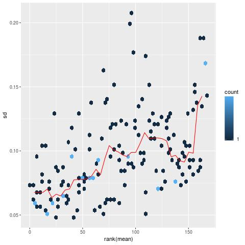

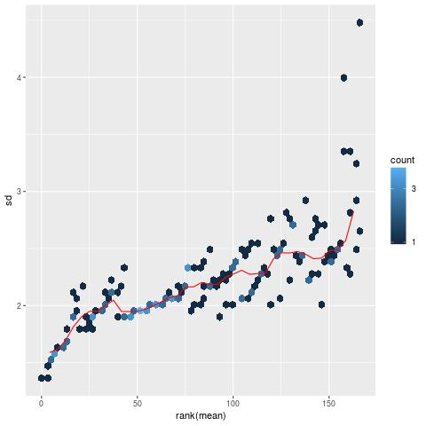

**Heatmap of the count matrix**  
To explore a count matrix, it is often instructive to look at it as a heatmap. Below we show how to produce such a heatmap for various transformations of the data.

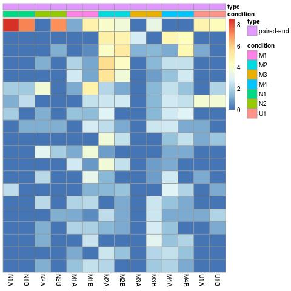 

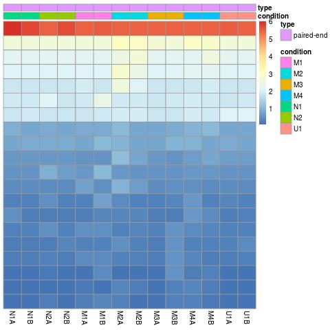
 
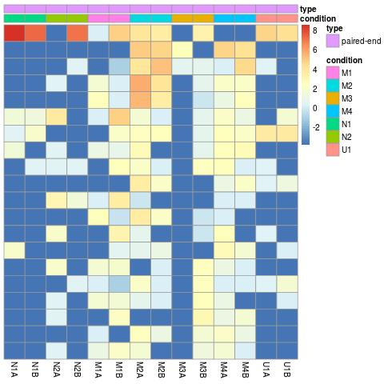
 
**Heatmap of the sample-to-sample distances**
Another use of the transformed data is sample clustering. Here, we apply the dist function to the transpose of the transformed count matrix to get sample-to-sample distances. A heatmap of this distance matrix gives us an overview of the similarities and dissimilarities between samples. We have to provide a hierarchical clustering hc to the heatmap function based on the sample distances, or else the heatmap function would calculate a clustering based on the distances between the rows/columns of the distance matrix. 

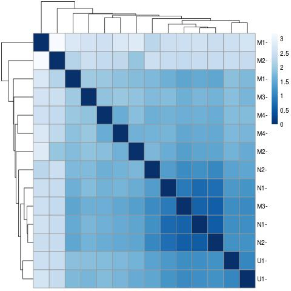

**Normalising gene expression distributions**
During the sample preparation or sequencing process, external factors that are not of biological interest can affect the expression of individual samples. For example, samples processed in the first batch of an experiment can have higher expression overall when compared to samples processed in a second batch. It is assumed that all samples should have a similar range and distribution of expression values. Normalisation is required to ensure that the expression distributions of each sample are similar across the entire experiment. Any plot showing the per sample expression distributions, such as a density or boxplot, is useful in determining whether any samples are dissimilar to others. Distributions of log-CPM values are similar throughout all samples within this dataset (panel B of the figure above).
Nonetheless, normalization by the method of trimmed mean of M-values (TMM) (Robinson and Oshlack 2010) is performed using the calcNormFactors function in edgeR. The normalization factors calculated here are used as a scaling factor for the library sizes. 

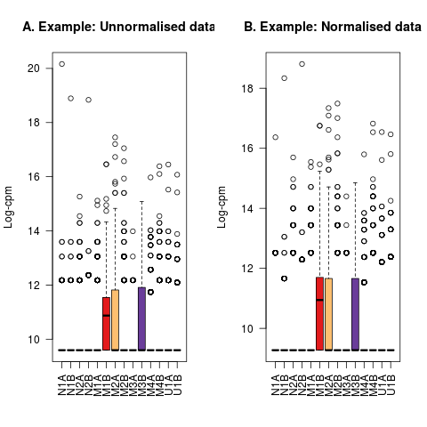

### GO term enrichment analysis

The next step is to apply the enrichment analysis to the DEG sets obtained in the above differential expression analysis using the package biomaRt. 
 and how to organize them for the downstream GO term enrichment analysis. Alternatively, the gene-to-GO mappings can be obtained for many organisms from Bioconductor’s *.db genome annotation packages or GO annotation files provided by various genome databases. For each annotation, this relatively slow preprocessing step needs to be performed only once. Subsequently, the preprocessed data can be loaded with the load function as shown in the next subsection.

#### Basic workflow

```{r, results = "hide", warning = FALSE, message = FALSE}
library(RNAseqAnalysis)
setwd("~/RNAseqAnalysis")
annotate(filter=c(Fold=2, FDR=100), id_type="gene", CLSZ=2, cutoff=0.01)
```

To access annotate functionality, the first step is to load RNAseqAnalysis package. Next step is to call the function as shown above. Once the function is called the list of marts as available by the biomart function would be displayed on the console and the user would be asked to "enter a Mart name from the list above:". The user must select the mart based on his/her dataset, for example, to run the example data set the user must enter "ENSEMBL_MART_ENSEMBL". Next, a list of datasets based on the mart select would be printed to the console and the user would be asked to "enter datasets from the one listed above: " for which the user must enter "celegans_gene_ensembl" if running the example data or according to the data being used. Finally a list of attributes corresponding to the dataset selected would be printed to the console and the user would be prompted to  "enter an attribute for go id " like "go_id", then the user must "enter an attribute for gene id corresponding to that of your data" for example "ensembl_transcript_id" and finally "enter an attribute for namespace" for which the user may enter "namespace_1003" to run the example data.

#### Result generated

The method=" all", returns all GO terms passing the p-value cutoff specified under the cutoff arguments, which is then saved to the file named GO_BatchResult.xls. And also the GO terms specified under the myslimv argument are also obtained and save in the file named GO_BatchResultslim.xls The data.frame is then plotted with the GOHyperGAll function of the package Systempiper. 

**Three plots are generated each representing Molecular function, Biological processes and Cellular component**

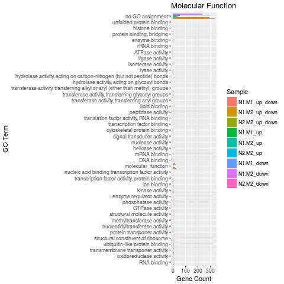

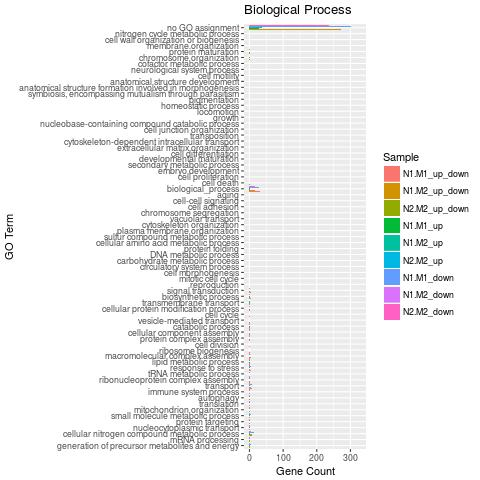

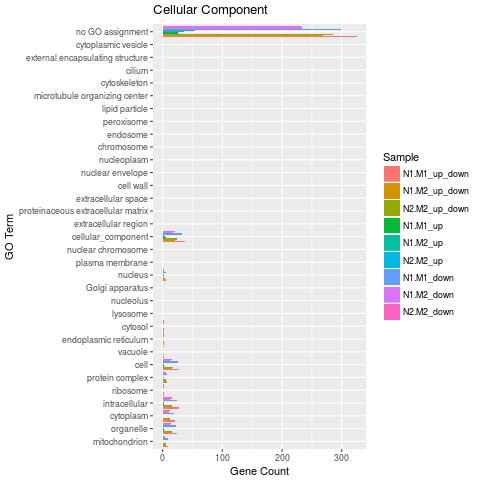
 
### Alternative Spliceing analysis 

A major application of RNA-Seq is to detect differential alternative splicing, i.e., differences in exon splicing patterns among different biological conditions. Alternative splicing (AS) is an essential and precisely regulated post-transcriptional gene regulation in eukaryotic organisms that expands the functional and regulatory diversity of a single gene by generating multiple mRNA isoforms that encode structurally and functionally distinct proteins. The RNASeqAnalysis package contains the function splice which is essentially a wrap around the ASpli R package, which is an integrative and user-friendly R package that facilitates the analysis of changes in both annotated and novel AS events. The proposed methodology reliably reflects the magnitude of changes in the relative abundance of different annotated and novel AS events. This method can be used to analyze both simple and complex experimental designs involving multiple experimental conditions. 

#### Basic workflow

```{r, results = "hide", warning = FALSE, message = FALSE}
library(RNAseqAnalysis)
setwd("~/RNAseqAnalysis")
bamfiles <- c("extdata/SRR5253683.bam", "extdata/SRR5253684.bam", "extdata/SRR5253685.bam", "extdata/SRR5253686.bam", "extdata/SRR5253687.bam", "extdata/SRR5253688.bam", "extdata/SRR5253689.bam", "extdata/SRR5253690.bam", "extdata/SRR5253691.bam", "extdata/SRR5253692.bam", "extdata/SRR5253694.bam", "extdata/SRR5253695.bam","extdata/SRR5253696.bam", "extdata/SRR5253697.bam")
col <- c("red","yellow","green","blue", "black", "pink", "violet")
grp <- c(rep("N1", 2),rep("N2", 2),rep("M1", 2),rep("M2", 2),rep("M3", 2),rep("M4", 2),rep("U1", 2))
#grp <- c(rep("U1", 2),rep("M3", 2))
splice(pair = c("U1", "M3"), group = grp, colour = col, bamFiles=bamfiles)
```

To access splice functionality, the first step is to load the RNAseqAnalysis package after which the function can be called as shown above. The basic requirement is a single BAM file for each sample in the experiment as well as a Txdb file. The Txdb file generated during the function countT is automatically called during the run, so it is important that the countT function is run before calling the splice function and also the path of the file generated is not changed. The bam files generated when the countT function is run may be used for the analysis of alternative splicing, but for this all the *.bam as well as *.bam.bai files generated during the countT runs must be placed in a single folder and each file must be named them accordingly (For example A_83.bam, A_83.bam.bai, A_84.bam, A_84.bam.bai). 

Using the method readCounts, read alignments are overlaid on features. Results are stored into an ASpliCounts object. Read densities (number of reads/feature length) are calculated for genes and bins. Count tables and read densities tables are produced at different genomic levels, including genes, bins, junctions, and intron flanking regions. To provide an integrative view of the AS events being analyzed, splice junction information is used to analyze differential bin usage. PSI (percent of inclusion) and PIR (percent of intron retention) metrics, which are extensively used to quantify AS are calculated. ASpli allows novel AS events to be identified based on the splice junction repertoire. A novel AS event is identified whenever a novel splice junction that shares its beginning or end with another splice junction is discovered. When a novel AS event is identified using the splice junction repertoire, the PSI metric is calculated and reported.

During the run of the splice function, the user would be asked to enter the number and the names of experimental conditions under study. It is a good practice to name the conditions as named in the targets.txt file and also the group and pairs provided during the calling of the function must be named accordingly.

#### Result generated

At each module, results are stored in ASpliObjects. Self-explanatory tables are exported at each step of the analysis and written to a tab-delimited table in a features-level output folder. The column of text tables has the same name and meaning (For more information check the ASpli vignettes). The exported text tables folders are arranged in subfolders "exons", "genes", "introns" and "junctions". The AS folder contains an additional text table: as_discovery.tab, that contains junction counts and PSI/PIR metrics for all bins. The All folder contains some additional tables: summary.tab, which contains bin DU usage for all bins together and bins_du_psi_pir.tab, that contains bin DU usage for all bins merged with PSI/PIR metrics.

Using genomic coordinates and BAM files this function also generates coverage plots. Inspection of coverage plots is a good practice for the interpretation of analytical results. After selection of AS candidates, it is possible to plot the results in a genome browser manner highlighting alternatively spliced regions. Coverage data is taken from bam files. Plots for each event are generated as below:

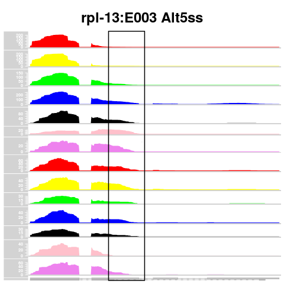

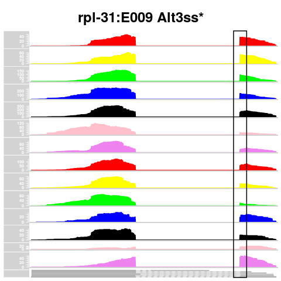

## Version information
```{r}
sessionInfo()
```
